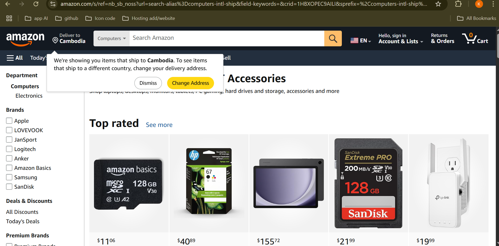

# Heading 1
## Heading 2
### Heading 3
#### Heading 4
my project is fous on 

### Settup / installtion

`npm install`

`pip install`

`composoer install`

### Todo List
- [] Home page
- [] ABout page
- [x] Service page

### Screenshot

### Link
CSS Framework [boxshadow](https://getcssscan.com/css-box-shadow-examples)

### List 
Unoder List
- one
- two
- three
    - other sub list
    -none
---
order List
1. One
2. Two
3. Three

### Text style
**Bbold text**

*Hello God*

~~Delete text~~

### Block quote
> Hello word

### Table
|id |name | Age |
|----|-----|-----|
| 01 | Miok | 20 |